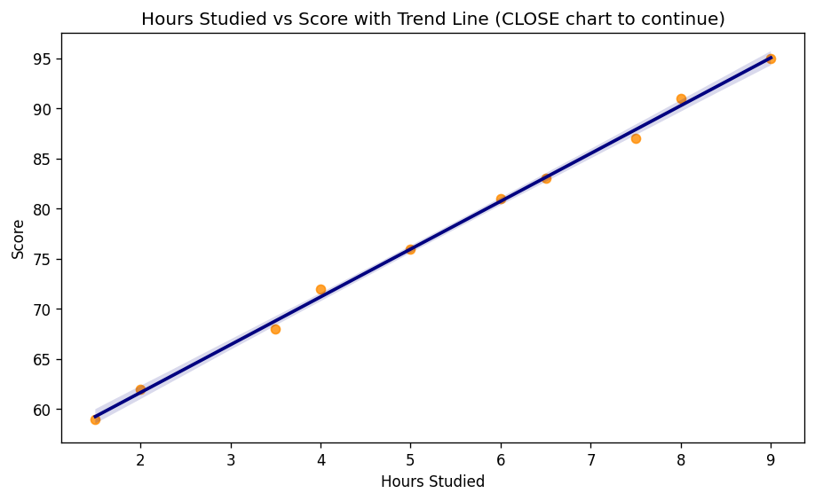
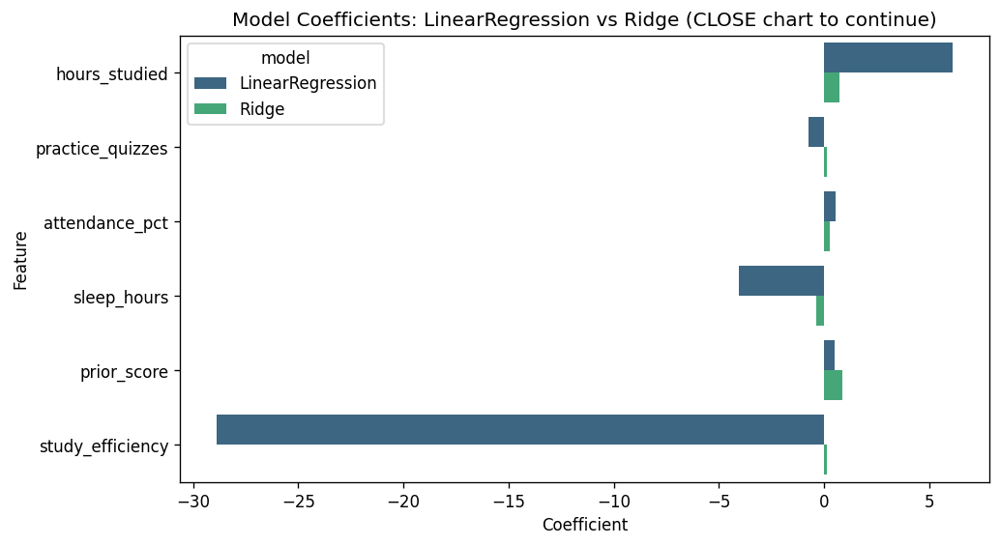
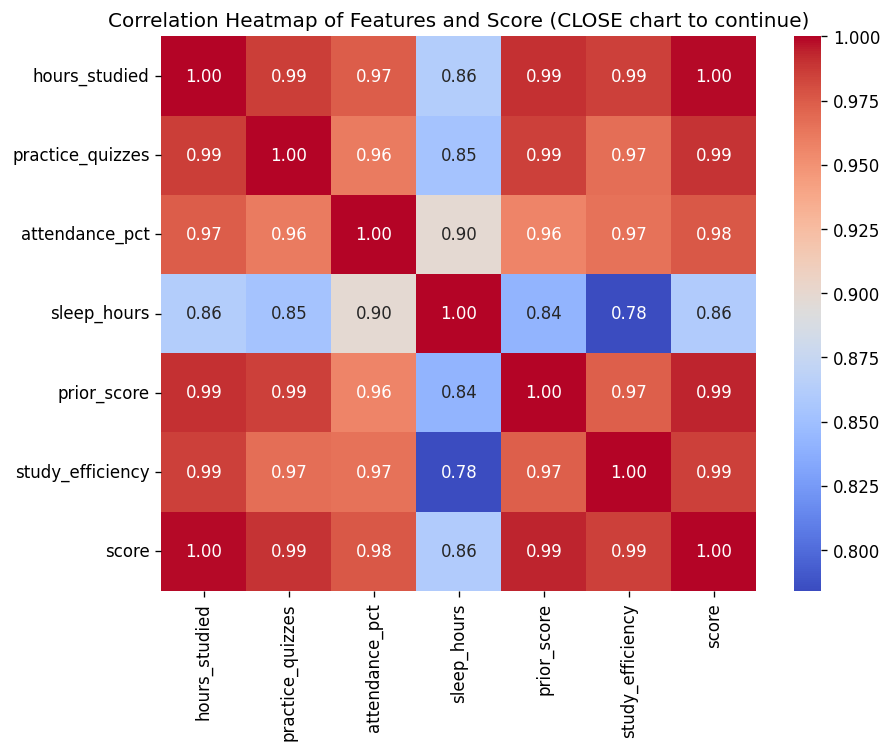
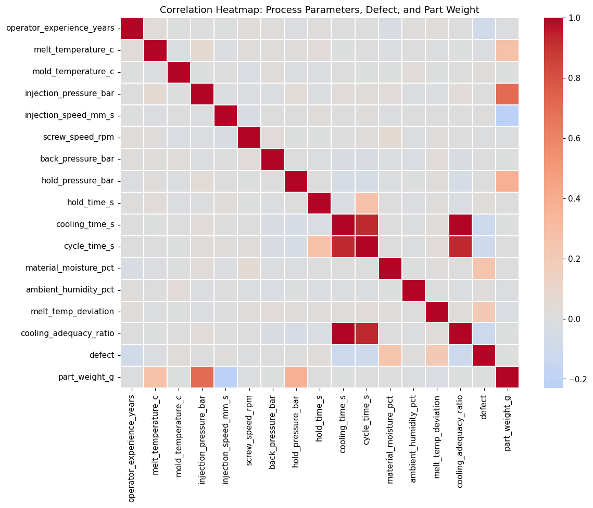
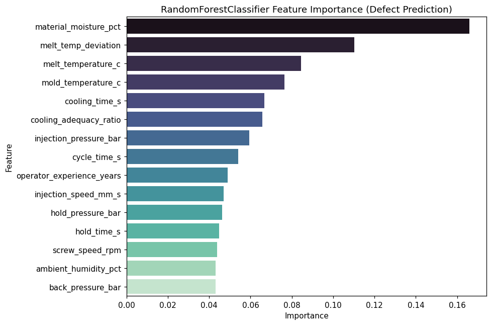
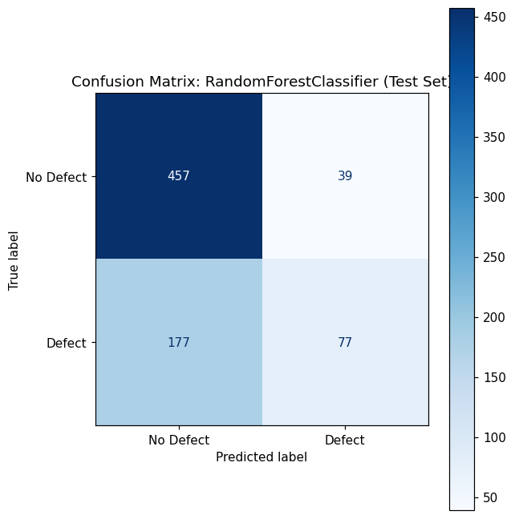
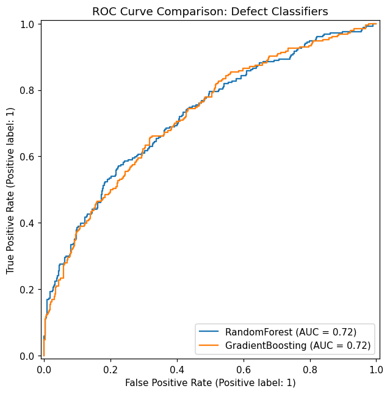
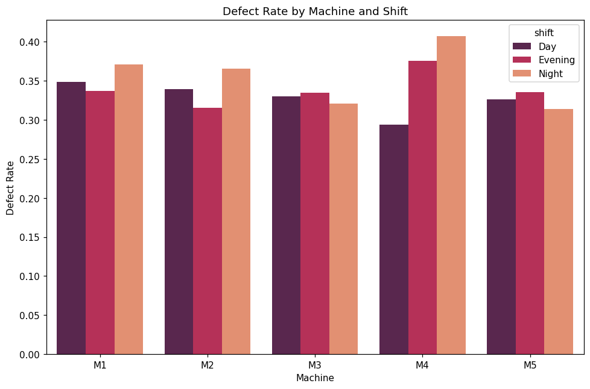
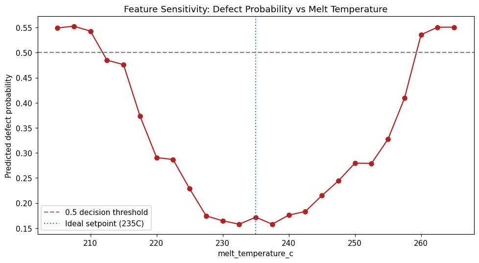

# ml-07-applied

[](https://denisecase.github.io/pro-analytics-02/workflow-b-apply-example-project/)
[](./pyproject.toml)
[](./LICENSE)

> Professional Python project: investigating a deployed machine learning model, then applying the same skills to a custom manufacturing process engineering project.

## Project Description

This project focuses on learning to interrogate a machine learning model
by probing it systematically with different inputs.

We learn to:

- call a live prediction API from a notebook
- vary input features and observe how predictions change
- identify decision boundaries and edge cases
- interpret model behavior from the outside

Author: Abdelhafidh Mahouel

## Example Notebook + My Notebooks

The original working examples are kept as-is for reference:

- [ml_07_case.ipynb](notebooks/ml_07_case.ipynb) - example: investigating a deployed penguin species API
- [ml_07_text_and_image_case.ipynb](notebooks/ml_07_text_and_image_case.ipynb) - optional example: text and image classification

My Phase 4 (technical modification) and Phase 5 (custom project) work:

- [ml_07_abdel.ipynb](notebooks/ml_07_abdel.ipynb) - Phase 4: modified version of the deployed model investigation
- [ml_07_text_and_image_abdel.ipynb](notebooks/ml_07_text_and_image_abdel.ipynb) - Phase 4 (optional): modified text/image notebook
- [ml_07_manufacturing_abdel.ipynb](notebooks/ml_07_manufacturing_abdel.ipynb) - Phase 5: custom manufacturing process engineering project

See [docs/your-files.md] for more on the naming convention.

## Working Files

- **data/raw** - raw data for exploration, including my custom `manufacturing_quality_abdel.csv` dataset
- **docs/** - project narrative and documentation, see [docs/index.md](docs/index.md) for my full Phase 4 and Phase 5 write-up
- **src/mlstudio/** - application code
  - `app_case.py` - original working example (unmodified, kept as reference)
  - `app_abdel.py` - Phase 4: my modified version of the example
  - `app_manufacturing_abdel.py` - Phase 5: my custom manufacturing project
- **notebooks/** - interactive analysis (see above)
- **pyproject.toml** - updated authorship & links
- **zensical.toml** - updated authorship & links

## Additional Packages

This project uses `requests` to make live API calls, and `scikit-learn`,
`seaborn`, and `numpy` for model training and visualization. All are listed
in `pyproject.toml`.

## Instructions (pro-analytics-02)

Follow the
[step-by-step workflow guide](https://denisecase.github.io/pro-analytics-02/workflow-b-apply-example-project/)
to complete:

1. Phase 1. **Start & Run**
2. Phase 2. **Change Authorship**
3. Phase 3. **Read & Understand**
4. Phase 4. **Make a Technical Modification**
5. Phase 5. **Apply the Skills to a New Problem**

## Challenges

Challenges are expected.
Sometimes instructions may not quite match your operating system.
When issues occur, share screenshots, error messages, and details about what you tried.
Working through issues is part of implementing professional projects.

## Success

After completing Phase 1. **Start & Run**, you'll have your own GitHub project,
with the example notebook executed and committed,
and running the example module will print out:

```shell
========================
Executed successfully!
========================
```

A new file `project.log` will appear in the root project folder.

## Phase 4: Technical Modification

I copied the working examples and created modified versions with several
real, coordinated changes rather than a single small edit. See
[docs/index.md](docs/index.md#phase-4-technical-modification) for the full
write-up, including what I observed and why it mattered.

### app_abdel.py (modified from app_case.py)

- Added a new engineered feature, `study_efficiency` (hours_studied / sleep_hours)
- Trained and compared **two** models instead of one: `LinearRegression` vs `Ridge`
- Predicted a new custom case with different input values
- Replaced the scatter plot with a `regplot` that includes a trend line
- Updated the coefficient bar chart to show both models side by side
- Added a brand-new chart: a correlation heatmap (not in the original example)

Run with:

```shell
uv run python -m mlstudio.app_abdel
```

### ml_07_abdel.ipynb (modified from ml_07_case.ipynb)

- Added a 4th baseline case
- Swept a different feature, `body_mass_g`, instead of `bill_length_mm`, with a new line-and-marker chart style
- Used a different feature pair, `bill_depth_mm` vs `body_mass_g`, for the prediction grid, with a new colormap
- Added two new edge cases

### ml_07_text_and_image_abdel.ipynb (optional, modified from ml_07_text_and_image_case.ipynb)

- Replaced the original text corpus with a new technology/music/travel corpus
- Compared **two** text models: `MultinomialNB` vs `LogisticRegression`
- Compared **two** image models: `LogisticRegression` vs `RandomForestClassifier`, and changed the train/test split from 80/20 to 70/30
- Added the missing function calls at the end of the notebook so it actually produces output (the original example only defined the functions without calling them)

## Phase 5: Custom Project - Manufacturing Process Engineering

For my custom project, I applied the Module 7 skills (train and evaluate
supervised models, predict new cases, and systematically probe a model's
behavior with feature sweeps, decision grids, and edge cases) to a new
domain: **injection molding process engineering in manufacturing**.

Full write-up, findings, and charts: [docs/index.md](docs/index.md#phase-5-custom-project)

### The problem

A plastics manufacturer records process settings for every production
batch on an injection molding line. I built a system that:

1. **Classifies** whether a batch is likely defective (`defect`), based on
   13 process parameters plus 2 engineered features, using and comparing
   `RandomForestClassifier` and `GradientBoostingClassifier`.
2. **Predicts** the continuous part weight in grams (`part_weight_g`) using
   `RandomForestRegressor`.
3. **Investigates** the trained classifier the same way the Module 7
   example investigated the deployed penguin API: sweeping one feature at
   a time, building a two-feature decision grid, and testing edge cases,
   but applied to a model I trained myself instead of an external API.

### Data

`data/raw/manufacturing_quality_abdel.csv` - a synthetic but realistically
engineered dataset of 3,000 injection-molding production batches across 19
columns (process parameters, part weight, defect flag, and defect type).
See `data/raw/README.md` for full column documentation and how the data
was generated.

Run with:

```shell
uv run python -m mlstudio.app_manufacturing_abdel
```

## Command Reference

<details>
<summary>Show command reference</summary>

### In a machine terminal (open in your `Repos` folder)

After you get a copy of this repo in your own GitHub account,
open a machine terminal in your `Repos` folder:

```shell
git clone https://github.com/AbdelhafidhMahouel/ml-07-applied

cd ml-07-applied
code .
```

### In a VS Code terminal

```shell
uv self update
uv python pin 3.14
uv lock --upgrade
uv sync --extra dev --extra docs --upgrade

uvx pre-commit install
uvx pre-commit autoupdate

git add -A
uvx pre-commit run --all-files
# repeat if changes were made
uvx pre-commit run --all-files

# run the original example module to verify the environment (.venv/)
uv run python -m mlstudio.app_case

# run my Phase 4 modified example
uv run python -m mlstudio.app_abdel

# run my Phase 5 custom manufacturing project
uv run python -m mlstudio.app_manufacturing_abdel

# run common chores
uv run ruff format .
uv run ruff check . --fix
uv run python -m pyright
uv run python -m pytest
uv run python -m zensical build

# save progress
git add -A
git commit -m "update"
git push -u origin main
```

</details>

## Notes

- Use the **UP ARROW** and **DOWN ARROW** in the terminal to scroll through past commands.
- Use `CTRL+f` to find (and replace) text within a file.
- You do not need to add to or modify `tests/`. They are provided for example only.
- Many files are silent helpers. Explore as you like, but nothing is required.
- You do NOT need to understand everything; understanding builds naturally over time.

## Troubleshooting >>>

If you see something like this in your terminal: `>>>` or `...`
You accidentally started Python interactive mode.
It happens.
Press `Ctrl+c` (both keys together) or `Ctrl+Z` then `Enter` on Windows.

## Findings and Visuals

### Phase 4 charts (app_abdel.py)







### Phase 5 charts (app_manufacturing_abdel.py)













## Project Documentation

Additional project instructions, terms, and my full Phase 4 / Phase 5 narrative:

[docs/index.md](docs/index.md)

## Citation

[CITATION.cff](./CITATION.cff)

## License

[MIT](./LICENSE)
