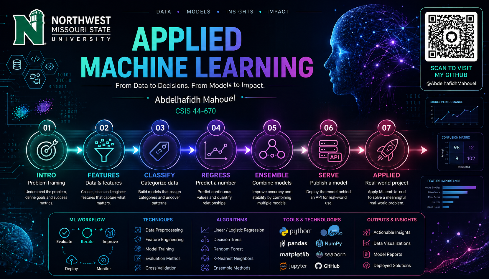

# Applied Machine Learning Portfolio
**Abdelhafidh Mahouel**
2026-08

  

Welcome to my portfolio for **CSIS 44-670: Applied Machine Learning** at Northwest Missouri State University. This course focused on techniques for examining data with the goal of extracting meaningful information and providing that information for use by other applications. Throughout the course, I worked through the full applied ML lifecycle — from framing a problem and engineering features, to building classification and regression models, combining models into ensembles, and finally serving a trained model behind an API. This page summarizes the seven projects I completed, the techniques I used, and — most importantly — the custom work and technical changes I made on top of each course example.

---

## 1. Machine Learning Introduction & Problem Characterization

### Repository Link
[View Repository](https://github.com/AbdelhafidhMahouel/ml-01-intro)

### Overview
This introductory project focused on understanding how to characterize a machine learning problem — the difference between supervised and unsupervised learning, and within supervised learning, regression versus classification. It also introduced the professional ML workflow used throughout the course: data inspection, quality checks, train/test splitting, evaluation, logging, and Git/GitHub. The starting example predicted a student's numeric exam score from study habits using Linear Regression.

### Phase 4 — Technical Modification
Rather than editing the professor's original script, I built my own version of the regression app and added an **Actual vs. Predicted Scores** chart. This let me judge how well the model's predictions matched real values visually, instead of relying only on the MAE/R² numbers printed to the terminal.

### Phase 5 — Custom Project
I reframed the same student-performance domain as a classification problem instead of a regression one. Rather than predicting a numeric score, I built a **Decision Tree Classifier** that labels a student as *At Risk* or *On Track* based on study hours, quizzes, attendance, sleep, and prior performance. This required swapping the model type entirely and switching the evaluation approach from MAE/R² to accuracy, precision, recall, and F1-score.

### Insights
The core lesson was that the same dataset can support very different ML problems depending on how you define the target — a continuous score calls for regression, a category calls for classification. It also reinforced that a perfect classification result on a very small dataset should be interpreted cautiously rather than treated as proof the model would generalize.

---

## 2. The ML Process, Data, and Features

### Repository Link
[View Repository](https://github.com/AbdelhafidhMahouel/ml-02-features)

### Overview
This project focused on the early stages of the ML process: understanding a dataset, assessing data quality, selecting useful predictors, and constructing new features — all applied to the same student-score regression problem from Module 1.

### What I Built
Rather than a phased modification, I extended the professor's baseline example into a more complete feature-engineering exercise. I engineered a new feature, `study_engagement` (study hours × attendance rate), to capture the interaction between how much a student studies and how consistently they attend class. I also expanded the data-quality checks to validate realistic ranges for every column (not just missing values and duplicates), and added residual analysis and additional visualizations — a correlation heatmap, an actual-vs-predicted comparison, and a residual plot — to better understand model behavior beyond the original two charts.

### Insights
The engineered `study_engagement` feature tracked final score almost as closely as `hours_studied` alone did — a useful reminder that a newly constructed feature doesn't automatically outperform the raw variables it's built from; its value has to be checked empirically rather than assumed.

---

## 3. Classification

### Repository Link
[View Repository](https://github.com/AbdelhafidhMahouel/ml-03-classification)

### Overview
This module covered training and evaluating classification models — reading a confusion matrix and classification report, and interpreting accuracy, precision, recall, and F1. The course examples covered a regression demo and a penguin-species classification notebook using a Decision Tree.

### Phase 4 — Technical Modification
I modified both course examples rather than the shared originals. On the regression script, I added an engineered `engagement_score` feature (study hours × attendance rate) and a new actual-vs-predicted residual chart. On the classification notebook, I added a `bill_ratio` feature (a composite bill-shape measurement) and a normalized confusion matrix alongside the original count-based one, plus saved CSV outputs of the predictions and classification report for auditability.

### Phase 5 — Custom Project
I designed and generated my own synthetic manufacturing dataset simulating a batch-release / quality-spec-compliance scenario (300 production batches, 8 in-process measurements like mixing time, temperature, pH, and operator experience). I trained a Decision Tree Classifier to predict pass/fail on each batch, producing a confusion matrix, a feature-importance chart, and a full classification report.

### Insights
Sweeping the decision tree's depth on the penguins notebook produced a textbook overfitting pattern — test accuracy peaked and then dipped as the tree got deeper — which directly informed the depth I chose for my own manufacturing model. Building the batch-release dataset also made the precision/recall tradeoff concrete: in that context, false alarms and missed failures carry very different real-world costs.

---

## 4. Regression Models

### Repository Link
[View Repository](https://github.com/AbdelhafidhMahouel/ml-04-regression)

### Overview
This module focused on linear regression, evaluating fit with MAE/RMSE/R², and diagnosing over- and under-fitting using a train-vs-test error curve across polynomial degrees.

### Phase 4 — Technical Modification
I added an RMSE metric alongside the example's existing MAE and R², and added a new residual plot (predicted value vs. error, with a zero reference line). This required a small refactor so the model's test-set predictions could be reused by the new charting function.

### Phase 5 — Custom Project
I applied the same regression approach to a real problem from my work as an engineering manufacturing team lead: predicting production-line defect rate from equipment, process, and workforce factors. I generated a synthetic 300-record dataset with 8 features (machine age, operator experience, maintenance interval, line speed, temperature, humidity, material grade, and shift) and built a full multivariable regression model, extending well beyond the course example's single-feature demonstration. I also added a train-vs-test RMSE curve to check for overfitting on this new data.

### Insights
The residual plot showed no funnel or curve pattern, which supported sticking with a linear model rather than something more complex, and the overfitting curve confirmed that a simple linear fit generalized best. The model's largest coefficients — material grade, shift, machine age, operator experience — also matched real manufacturing intuition, which was a good sanity check that the synthetic data behaved realistically.

---

## 5. Ensemble Models

### Repository Link
[View Repository](https://github.com/AbdelhafidhMahouel/ml-05-ensembles)

### Overview
This module covered ensemble methods — random forests and gradient boosting — compared against a single decision tree, and how added model complexity trades off against actual performance gains.

### Phase 4 — Technical Modification
I extended both course examples with new diagnostics rather than just changing a parameter. On the regression script, I added an RMSE metric and residual tracking. On the ensembles notebook, I added an `n_estimators` sweep (testing tree counts from 5 up to 400) along with logic to automatically detect the point of diminishing returns.

### Phase 5 — Custom Project
I built an original synthetic process-engineering dataset (300 batches, 6 process features such as temperature, pressure, catalyst concentration, and residence time) and rebuilt both the regression app and the ensemble-comparison notebook against it, comparing a single decision tree, a random forest, and gradient boosting on a 3-class product-quality target.

### Insights
On the course's clean penguins dataset, ensembles barely improved over a single tree, since the problem was almost trivially easy to separate. On my noisier custom dataset, the random forest's advantage over a single tree was more than twice as large — a concrete, numbers-backed demonstration that ensemble complexity is only worth the added cost when the underlying problem actually has room for it to help.

---

## 6. Model Deployment & Serving

### Repository Link
[View Repository](https://github.com/AbdelhafidhMahouel/ml-06-serving)

### Overview
This module focused on deploying a trained model behind a REST API using FastAPI — covering model serialization, input validation, and serving live predictions in a production-style pattern. The course example trained and served a penguin-species classifier.

### Phase 4 — Technical Modification
I extended the provided train → save → serve pipeline with a new engineered feature (`bill_ratio`) and, more importantly, added real input validation to the API layer — rejecting malformed requests with clear, specific error messages instead of letting the server crash or silently mispredict.

### Phase 5 — Custom Project
I built a full custom pipeline for a manufacturing quality-prediction problem. I wrote a synthetic data generator simulating an injection-molding production line (20 process parameters), trained and tuned a random forest classifier to predict pass/fail quality outcomes, and served it through its own FastAPI endpoint — alongside a simpler logistic regression baseline for comparison.

### Insights
The logistic regression baseline barely beat random guessing, because the real failure pattern was a "too high or too low" relationship that a linear model structurally can't represent. Switching to a random forest captured that non-linear relationship and meaningfully improved performance — a clear demonstration that model architecture, not just feature engineering, determines what's learnable. Handling the class imbalance in the data (failures were a small minority) and building real input validation into the API also turned out to be as significant a design task as training the model itself.

---

## 7. Applied ML Project

### Repository Link
[View Repository](https://github.com/AbdelhafidhMahouel/ml-07-applied)

### Overview
This capstone module focused on investigating how a deployed model behaves — probing an already-live penguin classification API with different inputs and observing how predictions changed — then applying that same investigative approach to a fully custom project.

### Phase 4 — Technical Modification
I modified both the example regression script and the model-investigation notebook — adding a new engineered feature (`study_efficiency`) and a second model (Ridge) for comparison, changing which features the notebook swept and probed, and adding new edge-case tests beyond the originals.

### Phase 5 — Custom Project
I designed and built a full custom project around injection-molding process engineering, generating a realistic 3,000-row dataset with two engineered features (deviation from the ideal melt temperature, and a cooling-adequacy ratio) and two prediction targets — a defect classifier (comparing random forest and gradient boosting) and a part-weight regressor. I then wrote a local function that mimics a deployed model's API and applied the same feature-sweep, 2D decision-grid, and edge-case investigation techniques from the original notebook to interrogate my own trained model.

### Insights
Sweeping melt temperature recovered a realistic U-shaped defect pattern — worse at both too-hot and too-cold — purely from the data, matching real injection-molding physics without that relationship being hard-coded anywhere except in how I generated the data. Comparing random forest and gradient boosting also showed that "best model" isn't just about overall accuracy: one had better precision, the other better recall, and which one matters more depends on whether a missed defect or a false alarm is more costly in a quality-control setting.
